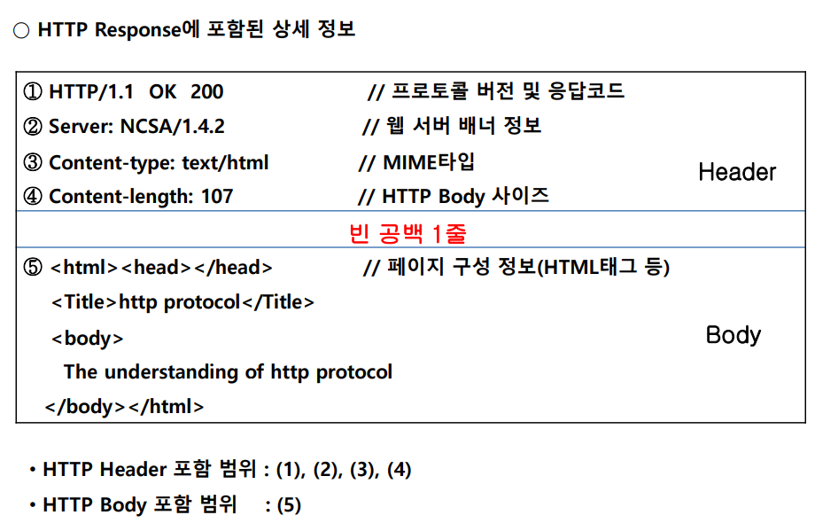

ilhank@naver.com
김일한
서울디지털 대학교

외부 배포를 많이 하는데 플라스크를 많이 사용한다.

자동차 계기판 == 대쉬보드 데이터 분석, 머신러닝, 예측 분류 --> 대쉬보드(외부로 표현)


화수목 7시간

금~금 8시간

이후 7시간

11:50~13:00


매일 과제가 나온다. 마지막 대쉬보드 금요일 미니 프로젝트

# 웹의 역사 및 구조
뭘 표현하기 위해서 코딩을 하는가? 웹 구조, 프로토콜의 구조를 알아야 왜 코딩하는지 알 수 있다.

## 마크업

처음에 컴퓨터가 나오고, 냉전시대 핵전쟁 -> 컴퓨터의 데이터를 백업해야 -> 컴퓨터와 컴퓨터를 연결(알파넷- 정보공유 시스템) -> 국가간 연결 -> 기업간 연결.. --> 인터넷

웹이라는게 왜 만들어졌는가? 국가간의 데이터를 교환하는데 서로 다른 양식의 인코딩을 씀(포멧이 다름)
전통적인 마크업: 책을 출판할 때 원고를 만들면 서식 설계사가 마크업 작업을 하면, 출판전문가가 마크업을 보고 출판했다. 이를 보고 착안한 것이 마크업 언얻
markup: (formatting) language for the web.
- 최초의 마크업 언어: SGML 절차적 언어(문서 기술 언어) -> 브라우저 소프트웨어가 해석함

Sgml -> html
- html은 한 쌍의 태그와 속성으로 이루어졌다. 
```html
<> </>
```
모자익 브라우저 탄생 -> 네스케이프 내비게이터 ->오페라 -> 모질라 제(파이어폭스) -> 사파리(애플) ->

html -> xml ->dom

오페라와 모질라 재단과 html을 업데이트 하지않고 플로그인으로 대체(어도비, 엑티브x..) -> 너무 무거워짐

--> html5 제안, W3C는 거부 bc: 플러그인이 전부 쓸모 없게된다. 
자체적으로 WHATWG 재단을 만들고, 익스플로어와 나머지 익스플로어와의 전쟁이 시작됨.

결국 html5가 우승: 크롬브라우저의 등장(성능이 너무 좋아서)
<ins>tex</ins>
html5test.com  --> ajax(에이젝스)


## URL

## HTTP
http request: 헤더와 바디로 이뤄짐
웹서버의 request객체가 있다. 해더와 바디에 있는 정보드를 끄지버 낼 수 있는 객체

### request
POST [request-uri]
HTTP/1.1 Host:[Hostname] 혹은 [IP] Content-Length:[Bytes] 
Content-Type:[Content Type]

#### get 요청 


GET 요청은 헤더에 실린다. ?요 연결함, 데이터의 크기는 2083바이트를 넘으면 안된다.
따라서 파일전송, 장문의 게시글쓰기는 GET요청으로 불가능하다.


#### post 요청
바디쪽에 얼마든지 데이터를 넣을 수 있다. 바디 쪽에 실린다.


### response

헤더에 리스폰스 코드 200을 넣고, 바디에 html을 넣어서 보내준다.

## html 브라우저 (렌더링 엔진 플로우)
리스폰스에서 받은 body를 랜더링 엔진에서 받는다. 랜더링하면 DOM이 된다.
DOM은 스트링을 객체로 받는다. head.method 이런식으로 객체화, 서로 트리구조로 연관관계를 맺는다. 자식, 후손, 부모 이런식으로, 시블링 --> beautiful soup에서 나옴
html -> dom -> display

자바 스크립트는 DOM(tree)을 접근해서 속성을 부여, 
- 따라서 자바스크립트는 프론트엔드 다이나믹이라 부른다. 서버와는 통신하지 않고 동적인 일을 수행하기 떼문.
렌더링 엔진의 종류: 사파리, 크롬(webkit), 파이어폭스(gecko) -> 오픈 소스
jquery, react, viewjs, angularjs ... -> 이쪽을 잘하면 높은 연봉을 받을 수 있다.
데이터를 받아오고 클라이언트가 계산하는 경우가 많아지고 있다.

? 돔구조를 보고 싶다면?

# 웹어플리케이션 아키텍처

web client 개인 -http->  request -> [web sever] 
[web sever] -> HTTP respose (html, css ,javascript, VBscript, )

개인이 특정 URl을 넣고 IP어드레스 DNS서버에서 아이피를 확인하고 문서를 요청함
해당 IP와 요청 문서를 넣으면 웹서버에서 이 문서를 응답(respose)한다 

이 때  웹서버를 구축하는게 우리의 목적이다. http 요청에 응답하는 response를 만드는거
nodejs, 아파치 등 많지만 파이썬으로 하자.

동적 웹, 정적 웹

플라스크에는 jinja (was: 웹어플리케이션 서비스) -> 서버 뒤에서 web app을 구성함
web app 뒤에는 또 DB가 있어서 데이터를 요청해서 web app이 만들고 클라이언트의 요청을 보내준다 ==> 동적 웹

was: jsp, spring, nodejs, jinja, jango
플라스크를 알면 장고도 금방 익힌다. 복잡한 웹에서는 장고를 쓴다.

커넥터: DB와 웹앱을 연결함


# Flask


## __name__ 
임포트하면 그 모듈이
직접 실행한거면,  __main__이 된다.(보안상의 이유인가?)
다른 모듈이 불러서 실행할 수도 있지 않나? 굳이 막는 이유는 뭘까?


## html은 크게 두가지 요소가 있다.
- block 요소:컨텐트(텍스트)가 브라우저의 행전체를 점유하는 경우
- 인라인요소: 컨텐트가 브라우저의 컨텐츠 크기 만틈만 점유


### block 요소(많이 차지함)
##### 개행발생 테그: hn, p, br (겁나 많이 차지)
- 시작 테그, 종료 테그 -> 한 행 전체를 차지한다.
개행-> 앞뒤로 공백이 생긴다.

##### 개행발생x div, table, ul, li
div는 한 행 전체를 가져가고

### 인라인 요소: a, span, Iframe, label, input
글자 크기만 점유함


## 이미지
단일 처리


